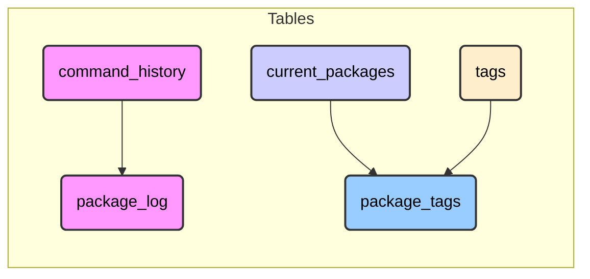

# zenv

> A comprehensive environment tracking and auditing tool for Linux & macOS package management

*(This README describes the features in development for the initial major release)*

`zenv` is a command-line utility designed to enhance your control and understanding of installed software across your Linux or macOS system. It acts as an auditing wrapper around existing package managers (like DNF, APT, Brew, Pip, etc.), maintaining a persistent, queryable ledger of all your software with rich metadata.

## Key Features

- **📜 Comprehensive Audit Trail**: Records detailed history of all software management actions, *linking specific user commands to the resulting package changes*.
- **🔍 Rich & Reliable Metadata**: Captures version, source repository, installation reason, timestamps, checksums, licenses, and more through *reliable post-operation checks*.
- **🔄 Unified Interface**: Provides consistent commands across multiple underlying package managers.
- **🏷️ Custom Organization**: Tag packages, add comments, and create custom categorizations using an *efficient normalized tag structure*.
- **🔎 Powerful Querying**: Filter installed packages and history by manager, tag, reason, date, and more.
- **📌 Manual Tracking**: Track software installed outside standard package managers (AppImages, binaries).
- **🩺 Health Checks**: Verify system state against ledger records and maintain consistency.
- **📊 Detailed Reporting**: Generate built-in reports for usage, licenses, and activity.

## Package Manager Support

| Package Manager | Type | Status |
|-----------------|------|--------|
| DNF (Fedora/RHEL) | System | ✅ Full Support |
| APT (Debian/Ubuntu) | System | 🔜 Planned |
| Pacman (Arch) | System | 🔜 Planned |
| Zypper (openSUSE) | System | 🔜 Planned |
| Portage (Gentoo) | System | 🔜 Planned |
| Brew (macOS) | System | 🔜 Planned |
| Pip (Python) | Language | 🔜 Planned |
| NPM (Node.js) | Language | 🔜 Planned |
| Go Modules | Language | 🔜 Planned |
| Cargo (Rust) | Language | 🔜 Planned |
| Gem (Ruby) | Language | 🔜 Planned |
| Manual entries | Custom | ✅ Supported |

## Getting Started

Initialize `zenv` to set up the ledger database:

```bash
zenv init
```

After initialization, discover your current system state:

```bash
zenv discover
```

## Usage Examples

### Installing packages

Install packages with `zenv` to track them in the ledger:

```bash
# Install packages through zenv (DNF in this case)
zenv install firefox vim 

# Add tags and comments
zenv install nodejs --tag dev,tools -c "For web development"

# Pass options to the underlying package manager
zenv install kernel-devel -- --enablerepo=updates-testing
```

### Querying your environment

```bash
# List all installed packages
zenv ledger

# Filter by manager
zenv ledger --manager dnf

# Filter by tag
zenv ledger --tag dev

# Filter by installation reason
zenv ledger --reason user

# Output in different formats
zenv ledger --output json
zenv ledger --output csv
```

### Viewing history

```bash
# View package history
zenv ledger history

# Filter history by date
zenv ledger history --since 2023-01-01 --before 2023-02-01
```

### Managing tags

```bash
# Add tags to an existing package
zenv tag firefox --manager dnf --add-tag browser,daily

# Remove tags
zenv tag vim --manager dnf --remove-tag temporary
```

### Adding manual entries

```bash
# Track software not managed by package managers
zenv add-manual signal-desktop --manager manual --location /opt/Signal --version 5.16.0 --tag communication
```

### Syncing with system state

```bash
# Check for discrepancies between zenv ledger and system
zenv sync

# Apply changes to reconcile differences
zenv sync --apply
```

### Generate reports

```bash
# Disk usage report
zenv report disk-usage

# License summary
zenv report licenses

# Recent activity
zenv report activity

# Package summary by manager
zenv report summary
```

## Database Structure

`zenv` uses a SQLite database to store package information, history, and metadata. The database consists of the following key tables:

### Main Tables

1. **`command_history`** - Audit trail of each `zenv` command execution
   - Records command string, timestamp, exit status, and PM command
   - *Crucially links to `package_log` via `command_id` to show which user action caused a change.*

2. **`current_packages`** - Current state of all tracked packages
   - Stores package name, manager, version, origin, install reason
   - Contains metadata like size, license, checksum, and *two key timestamps: the original installation time (best-effort from PM) and when `zenv` last updated the record.*
   - Updated whenever packages are installed, removed, or synced

3. **`package_log`** - Chronological history of all package events
   - Records installations, removals, updates, tag changes
   - *Linked back to the originating command via `command_id`.*
   - Preserves state at time of event (version, reason, etc.)

4. **`tags`** - Normalized tag definitions
   - Stores unique tag names *used for efficient and consistent categorization.*

5. **`package_tags`** - Links packages to tags
   - Associates packages with one or more tags

### Relationships



This database design allows for powerful querying and an accurate historical record of all package management actions, while providing rich metadata and custom organization through tags.

For more detailed visual diagrams of the architecture, database schema, and command flows, see [VISUALIZATIONS](./visualizations.md) -*might contain inconsistencies*.

## Command Reference

| Command | Description |
|---------|-------------|
| `zenv init` | Initialize the zenv environment and database |
| `zenv install <pkg...>` | Install packages and track in ledger |
| `zenv remove <pkg...>` | Remove packages and update ledger |
| `zenv ledger [installed\|removed\|history]` | Query the package ledger |
| `zenv discover [--clear-existing]` | Discover installed packages |
| `zenv sync [--apply]` | Check for discrepancies with system state |
| `zenv tag <pkg>` | Add or remove tags from packages |
| `zenv comment <pkg>` | Add/update comments for a package |
| `zenv add-manual <pkg>` | Manually add entries for unmanaged software |
| `zenv remove-manual-log <pkg>` | Remove a manual entry |
| `zenv report <subcommand>` | Generate reports (disk-usage, licenses, etc.) |
| `zenv check-health` | Verify ledger consistency |
| `zenv check-db` | Check database integrity |

## Implementation Status

The following matrix shows the implementation status of commands for each supported package manager:

| Command | DNF | APT | Pacman | Zypper | Portage | Brew | Pip | NPM | Go Modules | Cargo | Gem | Manual |
|---------|-----|-----|--------|--------|---------|------|-----|-----|------------|-------|-----|--------|
| `init` | ✅ | 🔜 | 🔜 | 🔜 | 🔜 | 🔜 | 🔜 | 🔜 | 🔜 | 🔜 | 🔜 | ✅ |
| `install` | ✅ | 🔜 | 🔜 | 🔜 | 🔜 | 🔜 | 🔜 | 🔜 | 🔜 | 🔜 | 🔜 | N/A |
| `remove` | ✅ | 🔜 | 🔜 | 🔜 | 🔜 | 🔜 | 🔜 | 🔜 | 🔜 | 🔜 | 🔜 | N/A |
| `ledger` | ✅ | 🔜 | 🔜 | 🔜 | 🔜 | 🔜 | 🔜 | 🔜 | 🔜 | 🔜 | 🔜 | ✅ |
| `discover` | ✅ | 🔜 | 🔜 | 🔜 | 🔜 | 🔜 | 🔜 | 🔜 | 🔜 | 🔜 | 🔜 | ✅ |
| `sync` | ✅ | 🔜 | 🔜 | 🔜 | 🔜 | 🔜 | 🔜 | 🔜 | 🔜 | 🔜 | 🔜 | ✅ |
| `tag` | ✅ | 🔜 | 🔜 | 🔜 | 🔜 | 🔜 | 🔜 | 🔜 | 🔜 | 🔜 | 🔜 | ✅ |
| `comment` | ✅ | 🔜 | 🔜 | 🔜 | 🔜 | 🔜 | 🔜 | 🔜 | 🔜 | 🔜 | 🔜 | ✅ |
| `add-manual` | ✅ | 🔜 | 🔜 | 🔜 | 🔜 | 🔜 | 🔜 | 🔜 | 🔜 | 🔜 | 🔜 | ✅ |
| `remove-manual-log` | ✅ | 🔜 | 🔜 | 🔜 | 🔜 | 🔜 | 🔜 | 🔜 | 🔜 | 🔜 | 🔜 | ✅ |
| `report` | ✅ | 🔜 | 🔜 | 🔜 | 🔜 | 🔜 | 🔜 | 🔜 | 🔜 | 🔜 | 🔜 | ✅ |
| `check-health` | ✅ | 🔜 | 🔜 | 🔜 | 🔜 | 🔜 | 🔜 | 🔜 | 🔜 | 🔜 | 🔜 | ✅ |
| `check-db` | ✅ | 🔜 | 🔜 | 🔜 | 🔜 | 🔜 | 🔜 | 🔜 | 🔜 | 🔜 | 🔜 | ✅ |

✅ = Implemented  
🔜 = Planned  
N/A = Not Applicable
