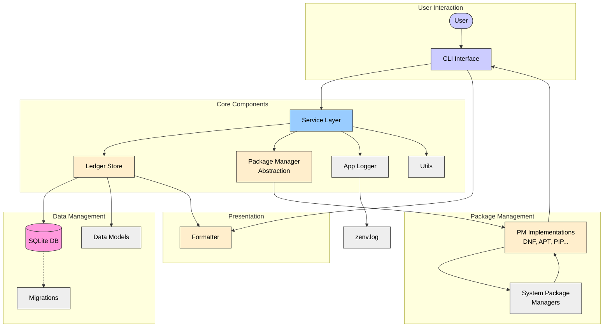
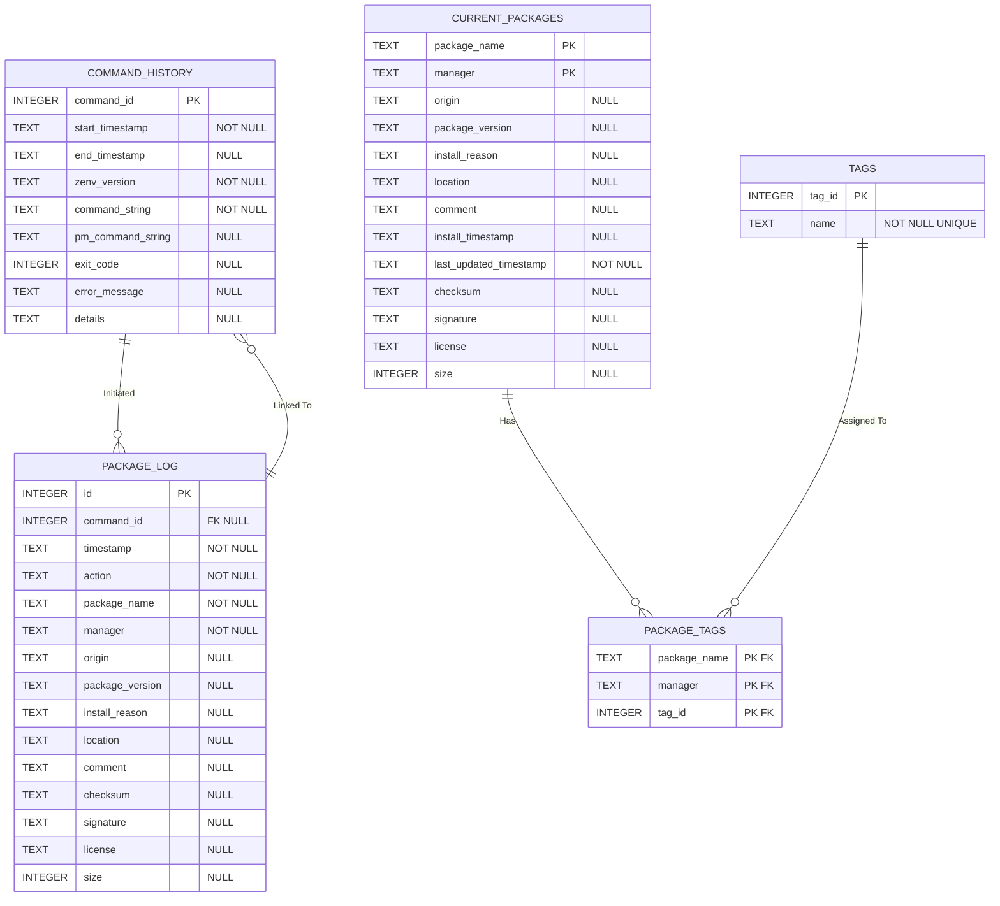
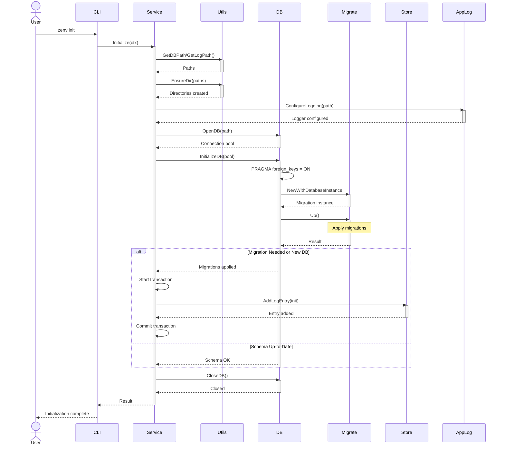
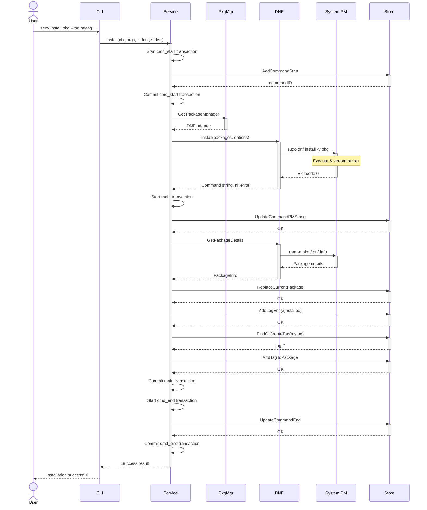
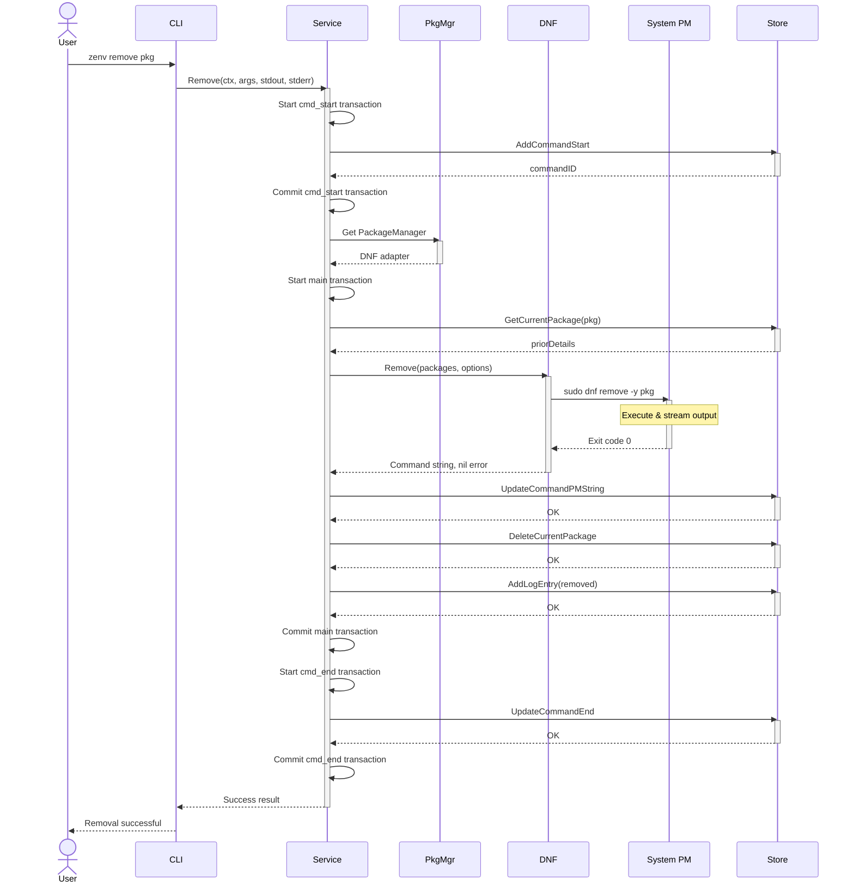
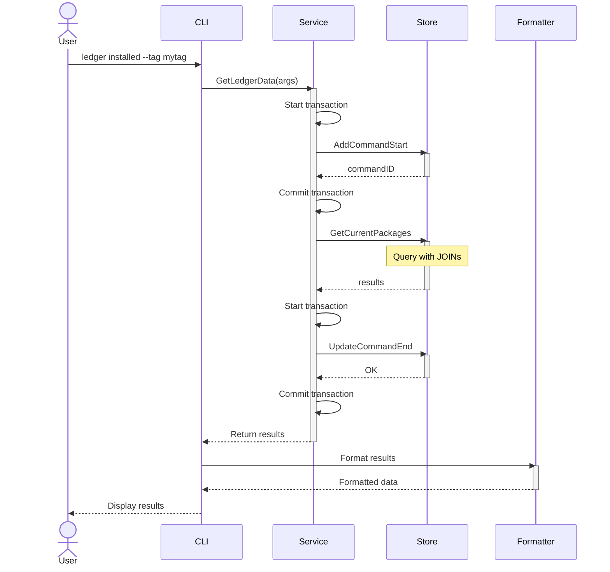
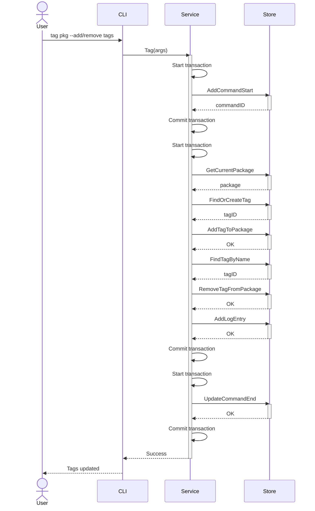
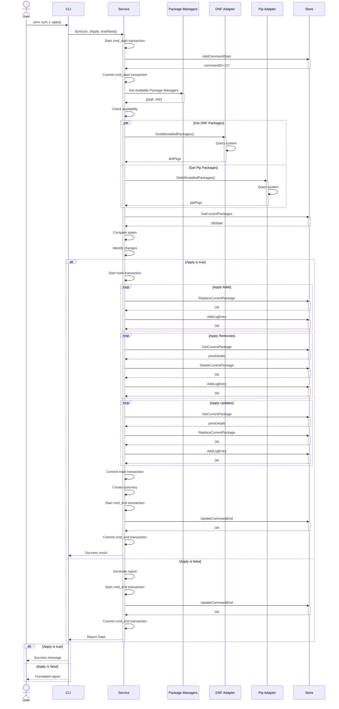
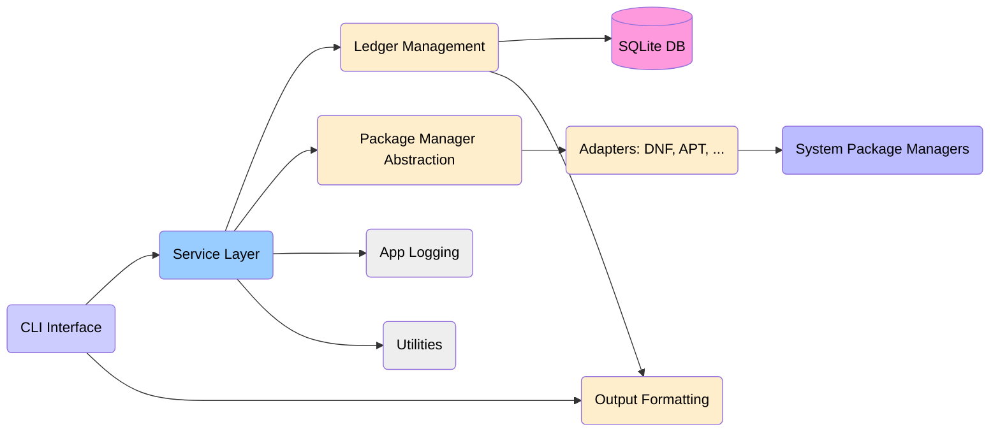
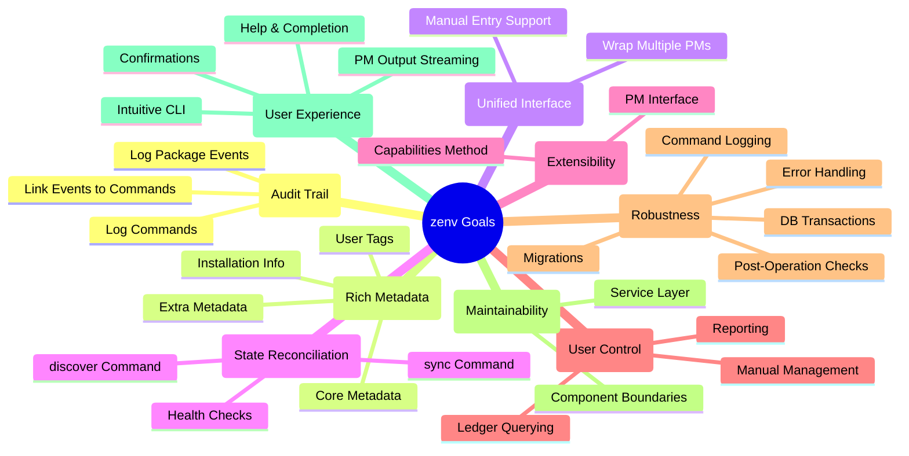

# zenv - Visualized Architecture and Flows

This document provides visual representations (using Mermaid.js) of the `zenv` tool's architecture, database schema, and command flows.

*mermaid renderer is only available on github web, AFAIK the following diagrams/charts won't render on github mobile apps, view this page on a mobile browser if you need to* 

## 1. Overall Architecture

This diagram shows the high-level components of `zenv` and how they interact when a user executes a command.

**Explanation:**

1.  **User Input:** The user interacts with `zenv` via the command line.
2.  **CLI Layer (`internal/cli`):** Parses the user's command, flags, and arguments using the Cobra library. Acts as a thin client.
3.  **Service Layer (`internal/service`):** The core orchestration engine. Receives requests from the CLI, manages database transactions, coordinates interactions between the ledger store and package manager adapters, handles core business logic, and logs command history.
4.  **Ledger Store (`internal/ledger/store`):** The Data Access Object (DAO) layer. Encapsulates all SQL logic for interacting with the SQLite database. Provides methods for CRUD operations and querying the ledger tables (`command_history`, `current_packages`, `package_log`, `tags`, `package_tags`).
5.  **Package Manager Abstraction (`internal/pkgmgr`):** Defines the `PackageManager` interface and contains specific implementations (adapters) for different package managers (e.g., `dnf`, `apt`, `pip`). Handles executing underlying PM commands, post-operation checks for metadata, and reporting capabilities.
6.  **SQLite Database (`ledger.db`):** The persistent storage for all tracked package information, logs, tags, and command history. Schema is managed via `golang-migrate/migrate`.
7.  **Underlying Package Manager:** The actual system or language package manager (e.g., `dnf`, `apt`) that `zenv` wraps.
8.  **Formatter (`internal/ledger/format`):** Takes data retrieved by the Store and formats it into user-requested outputs (table, JSON, CSV).
9.  **Configuration (`internal/util/fs`, `config.toml`):** Handles loading settings from a config file (e.g., defaults, report aliases).
10. **Logger (`internal/applog`):** Provides structured logging for debugging and diagnostics to `zenv.log`.
11. **Utilities (`internal/util`):** Contains shared helper functions (filesystem, time, errors).
12. **Models (`internal/ledger/models`):** Defines the Go structs mapping to database tables.

## 2. Ledger Database Schema (ER Diagram)

This diagram shows the structure of the SQLite database (`ledger.db`) and the relationships between the tables used to store the audit trail and package state.

**Explanation:**

*   `COMMAND_HISTORY`: Records every invocation of the `zenv` command.
*   `CURRENT_PACKAGES`: Stores the last known state of each package tracked by `zenv`. Uniquely identified by `package_name` and `manager`.
*   `PACKAGE_LOG`: An append-only log of specific events (install, remove, tag update, sync change) affecting packages. Each event is linked back to the `COMMAND_HISTORY` entry that caused it (if applicable).
*   `TAGS`: Stores unique tag names.
*   `PACKAGE_TAGS`: A linking table connecting packages in `CURRENT_PACKAGES` to their assigned tags in the `TAGS` table, enabling many-to-many relationships. Foreign key constraints with `ON DELETE CASCADE` ensure data integrity when packages or tags are removed.

## 3. Command User Flows (Sequence Diagrams)

These diagrams illustrate the typical sequence of interactions between components for key `zenv` commands.

### 3.1 `zenv init`

### 3.2 `zenv install <pkg> --tag <tag>`

### 3.3 `zenv remove <pkg>`

### 3.4 `zenv ledger installed --tag <tag>`

### 3.5 `zenv tag <pkg> --add-tag <t1> --remove-tag <t2>`

### 3.6 `zenv sync`

**Explanation (`sync`):**
1. User runs `zenv sync` (optionally with `--apply`).
2. CLI calls `Service.Sync`.
3. Service logs command start.
4. Service identifies available package managers.
5. Concurrently (or sequentially) calls `GetAllInstalledPackages` on each adapter to get the current system state (`systemState`).
6. Fetches the current ledger state from the database using `Store.GetCurrentPackages` (`dbState`).
7. Compares `systemState` and `dbState` to identify packages added, removed, or updated outside of `zenv`.
8. If `--apply` is **false**:
    * Generates a report detailing the differences.
    * Logs command end (with report details).
    * Returns the report to the CLI for display.
9. If `--apply` is **true**:
    * Starts the main DB transaction.
    * For **Adds**: Creates `CurrentPackage` from system state, calls `Store.ReplaceCurrentPackage`, logs `sync_add` event.
    * For **Removals**: Fetches prior details, calls `Store.DeleteCurrentPackage`, logs `sync_remove` event.
    * For **Updates**: Creates updated `CurrentPackage` from system state (preserving original install time), calls `Store.ReplaceCurrentPackage`, logs `sync_update` event. (All operations update `last_updated_timestamp`).
    * Commits the main transaction.
    * Logs command end (potentially with a summary of changes).
    * Returns success to the CLI.

## 4. Requirements Sections Visualization

Visualizing key aspects mentioned in the requirements document.

### 4.1 Core Components (Simplified Relationship)

**Explanation:** This mirrors the main architecture diagram but focuses solely on the internal components and their primary relationships as described in Section 3 of the ADD.

### 4.2 Goals Overview (Mind Map)

**Explanation:** This mind map categorizes and lists the primary goals defined in Section 2 of the ADD (`requirements.md`), providing a quick visual summary of the project's objectives.

This concludes the visual overview. These diagrams should help in understanding the structure, data flow, and intended functionality of the `zenv` tool.
